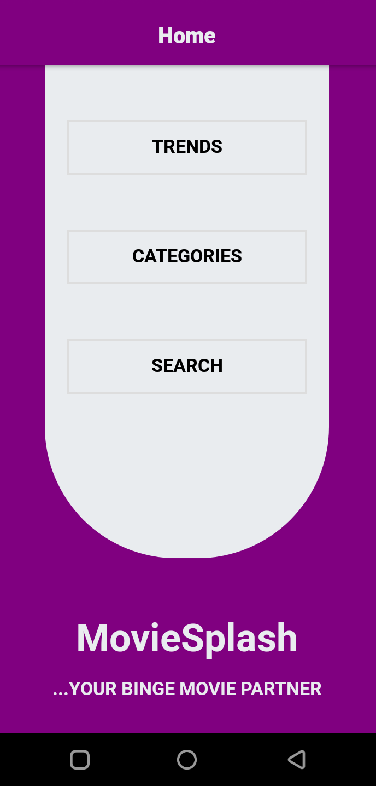
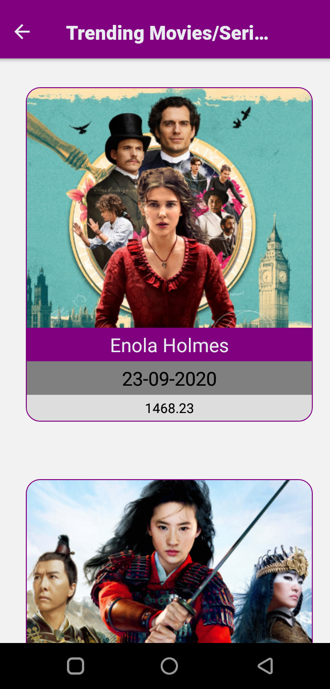
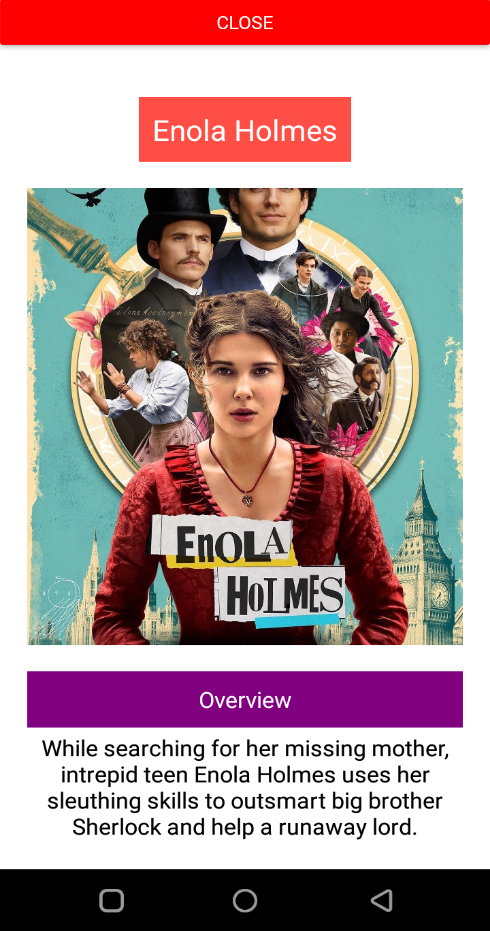
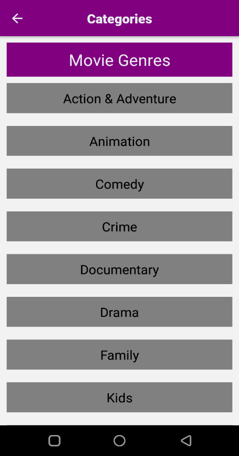

[![Contributors][contributors-shield]][contributors-url]
[![Forks][forks-shield]][forks-url]
[![Stargazers][stars-shield]][stars-url]
[![Issues][issues-shield]][issues-url]
[![MIT License][license-shield]][license-url]

# MovieSplash

An android app built using the React-Native framework to showcase movies grouped by categories and IMDB rating.

## App

<table>
  <tr>
    <td></td>
    <td></td>
  <tr>
  <tr>
    <td></td>
    <td></td>
  </tr>
</table>

## How to use

- Clone (this repo)[https://github.com/mikenath223/moviesplash]
- Run `npm install` in the terminal
- Ensure your Android or IOS emulator is running
- Run `npm start` to start Metro server.
- Run `npm run android` to bundle files and install app on emulator
- Or run `npm run ios` to run on IOS device.

## Dependencies

- react
- react-native
- react-navigation
- react-native-fast-image

# Author

**Michgolden Ukeje**

- Github: [@mikenath223](https://github.com/mikenath223)
- Twitter: [@Michgolden_Nath](https://twitter.com/MichgoldenU)
- Linkedin: [Ukeje Michgolden](https://https://www.linkedin.com/in/michgoldenukeje/)
   

# License

This project is licensed under the MIT License - see the [LICENSE.md](LICENSE.md) file for details

<!-- ACKNOWLEDGEMENTS -->

## Acknowledgements

- [Microverse](https://www.microverse.org/)
- [The Odin Project](https://www.theodinproject.com/)

<!-- MARKDOWN LINKS & IMAGES -->
<!-- https://www.markdownguide.org/basic-syntax/#reference-style-links -->

[contributors-shield]: https://img.shields.io/github/contributors/mikenath223/moviesplash.svg?style=flat-square
[contributors-url]: https://github.com/mikenath223/moviesplash/graphs/contributors
[forks-shield]: https://img.shields.io/github/forks/mikenath223/moviesplash
[forks-url]: https://github.com/mikenath223/moviesplash/network/members
[stars-shield]: https://img.shields.io/github/stars/mikenath223/moviesplash
[stars-url]: https://github.com/mikenath223/moviesplash/stargazers
[issues-shield]: https://img.shields.io/github/issues/mikenath223/moviesplash
[issues-url]: https://github.com/mikenath223/moviesplash/issues
[license-shield]: https://img.shields.io/github/license/mikenath223/moviesplash
[license-url]: https://github.com/mikenath223/moviesplash/blob/master/LICENSE.txt
